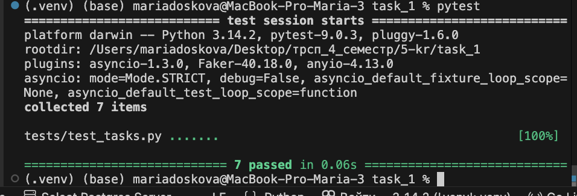
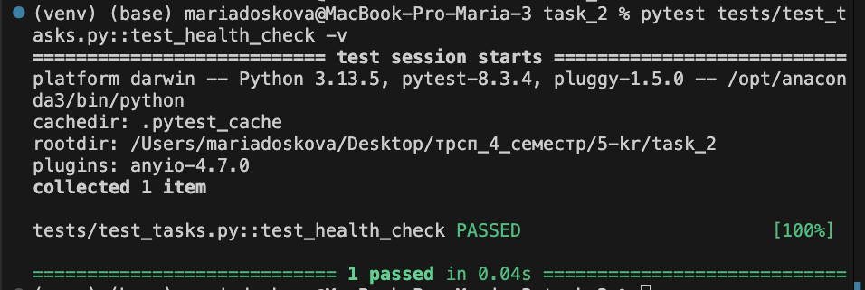
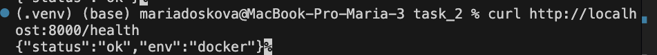
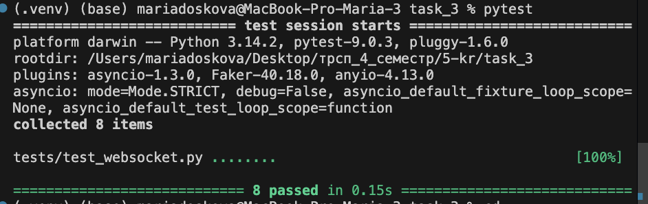
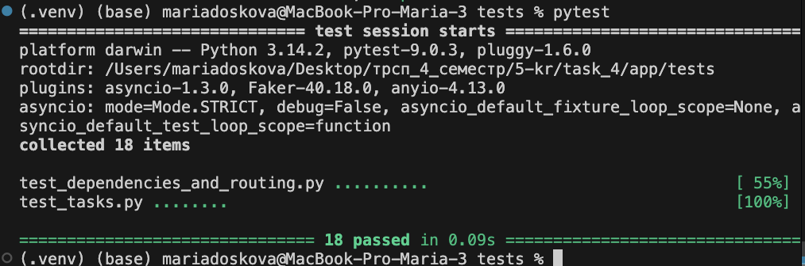

# Контрольная работа 5  

**Технологии разработки серверных приложений**  
**Студент:** Доськова Мария Павловна  
**Группа:** ЭФБО-03-24  
**Семестр:** 4 семестр, 2025/2026 уч. год

## Инструкция по запуску
1. Клонировать репозиторий:
```bash
git clone https://github.com/mitjink/sadt_kr5    
```
2. Создать и активировать виртуальное окружение:

### Windows
```bash
python -m venv venv  
venv\Scripts\activate
```

### Mac/Linux
```bash
python3 -m venv venv  
source venv/bin/activate
```

3. Установить зависимости:
```bash
pip install -r requirements.txt 
```
## Задание 1


## Задание 2



## Задание 3


## Задание 4
